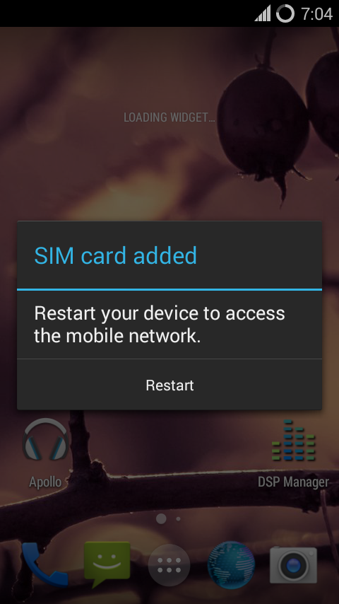

## Home - TamsuiCM11
We are a group of unofficial maintainers of the CyanogenMod custom ROM for certain Xperia devices. Our aim is to provide better CyanogenMod support for the Xperia Miro, E, J and Tipo.

**Current status - Alpha**

(18.03.2014) Major bugs we have to fix for all devices are:
- Camera
- Video playback
- Finish audio HAL
- Screen wake on some brightness levels.

*After installing CM11, when the device starts up, you may get the following message:*

**Do not tap Restart - instead, tap on the empty space around the message.**
